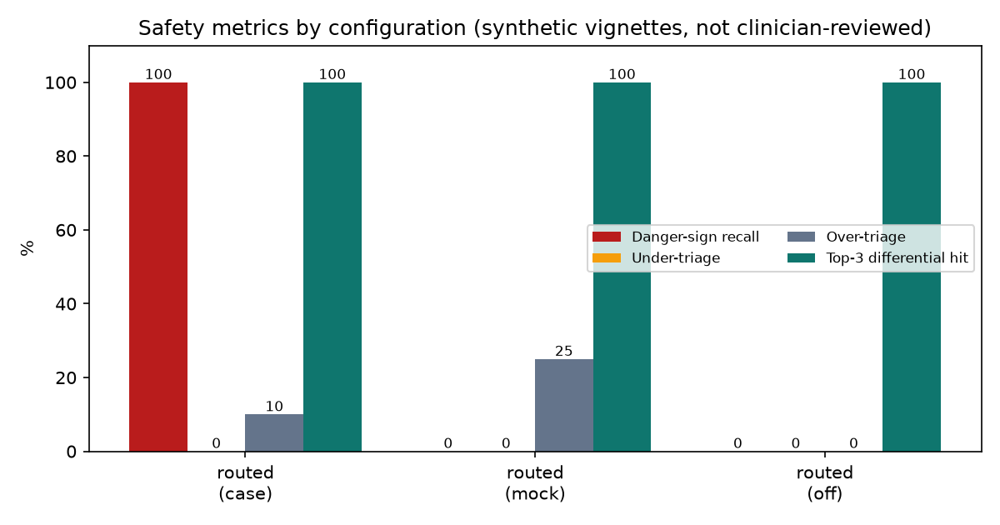
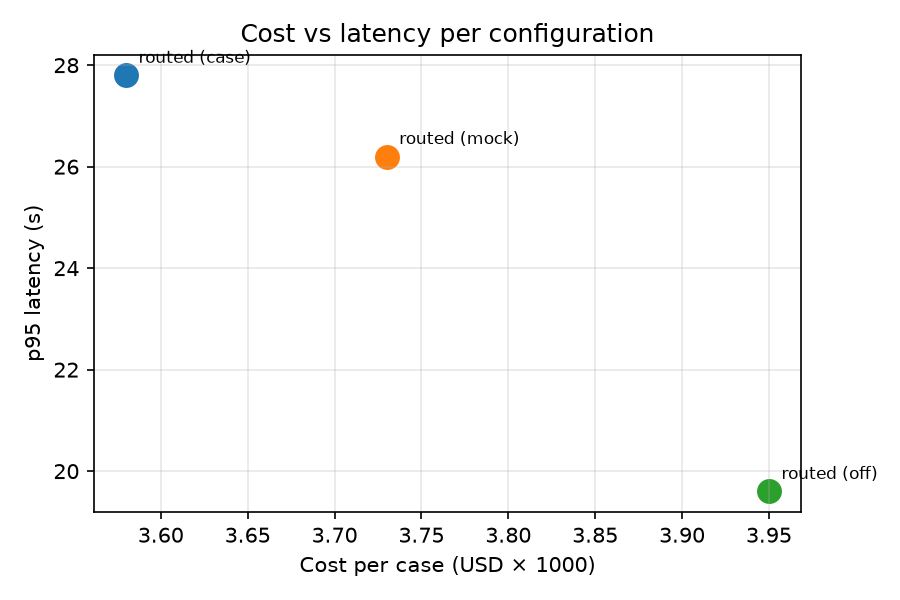
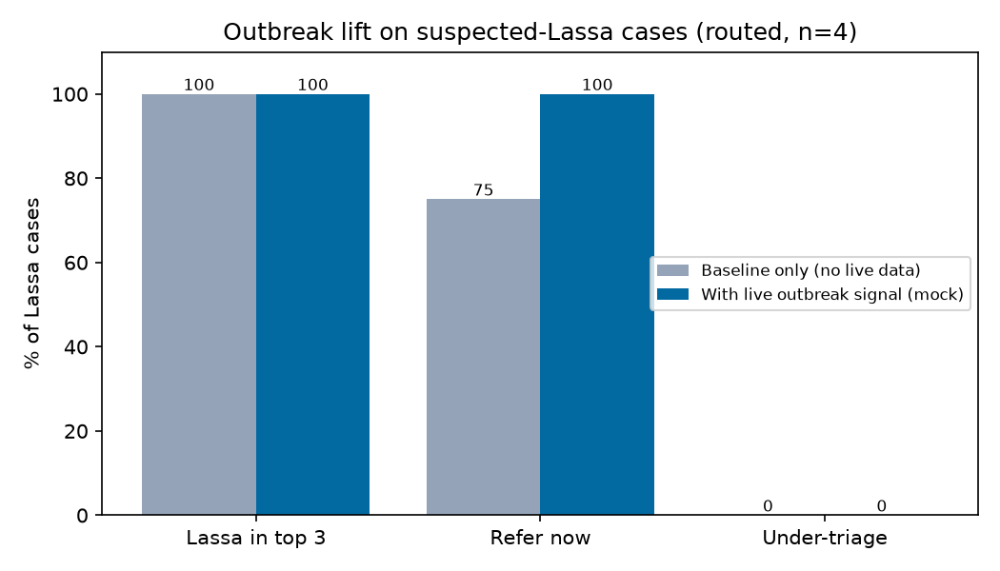

# Iba eval report

> Synthetic vignettes; gold labels **not yet clinician-reviewed**. Treat these numbers as
> a development check, not a clinical validation.

## Metrics

| Config (outbreak) | n | Danger-sign recall | **Under-triage** | Over-triage | Exact triage | Top-3 dx hit | Citation validity | p50 / p95 latency | Cost / case |
|---|---|---|---|---|---|---|---|---|---|
| routed (case) | 10 | 100.0% (4 signs) | **0.0%** | 10.0% | 90.0% | 100.0% | 100.0% (95) | 18.0 s / 27.8 s | $0.00358 |
| routed (mock) | 4 | — (0 signs) | **0.0%** | 25.0% | 75.0% | 100.0% | 100.0% (26) | 21.8 s / 26.2 s | $0.00373 |
| routed (off) | 4 | — (0 signs) | **0.0%** | 0.0% | 100.0% | 100.0% | 100.0% (39) | 17.8 s / 19.6 s | $0.00395 |

- **Under-triage** (predicted less urgent than gold) is the headline safety metric.
- Citation validity = model citations that resolved to an indexed guideline chunk or a current outbreak source (deterministic check).
- Latency uses each step's original model time (cache replays report the first run's time).

### Under-triaged cases: routed (case)

None.

### Under-triaged cases: routed (mock)

None.

### Under-triaged cases: routed (off)

None.

## Outbreak lift (suspected-Lassa cases)

Same cases run with live outbreak search off (static baseline only) and with a mock live Lassa signal for the case's state. Mock data stands in for Tavily until credits arrive.

| Config | n | | Lassa in top 3 | Refer now | Under-triage |
|---|---|---|---|---|---|
| routed | 4 | without live signal | 100.0% | 75.0% | 0.0% |
| routed | 4 | with live signal | 100.0% | 100.0% | 0.0% |

## Citation support (LLM-judged)

**This section is judged by an LLM** (Nemotron 3 Super, reasoning off) on a ~20% sample of cases: does the cited guideline chunk support the claim it is attached to? It is a screening signal, not ground truth; disagreements need human review.

| Config (outbreak) | Cases | Pairs | Supported | Partial | Unsupported |
|---|---|---|---|---|---|
| routed (case) | 2 | 10 | 10.0% | 30.0% | 60.0% |
- partial: `ncdc-cholera:0030` for "Cholera: Profuse watery stool and vomiting consistent with acute watery diarrhoea; Signs of severe dehydration (sunken e": The passage details signs of severe dehydration including sunken eyes and inability to drink, supporting parts of the claim about dehydration symptoms, but it does not mention profuse watery stool, vomiting, or that Borno state is endemic/peak season for cholera.
- partial: `who-imci:0004` for "Cholera: Profuse watery stool and vomiting consistent with acute watery diarrhoea; Signs of severe dehydration (sunken e": The passage describes signs of severe dehydration including sunken eyes and mentions cholera antibiotics in endemic areas, supporting parts of the claim about dehydration signs and Borno's cholera context, but does not mention profuse watery stool, vomiting, or explicitly confirm Borno's endemic status/peak season.
- partial: `who-imci:0004` for "Severe dehydration due to acute watery diarrhoea (non‑cholera): Clinical picture of severe dehydration (sunken eyes, una": The passage describes clinical signs of severe dehydration including sunken eyes and inability to drink, supporting that aspect of the claim, but it does not mention absence of bloody stool or lack of fever as indicators to reduce likelihood of dysentery or invasive bacterial infection.

## Charts

