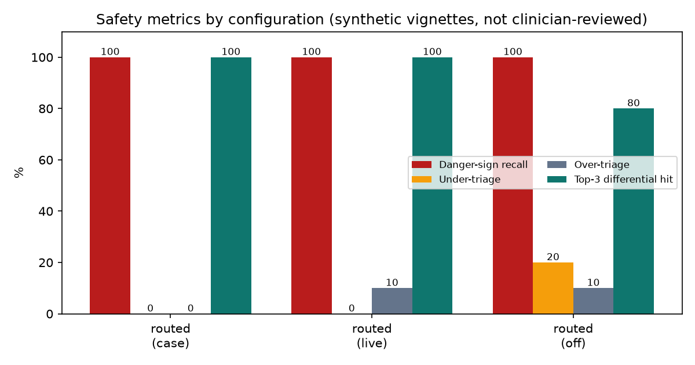
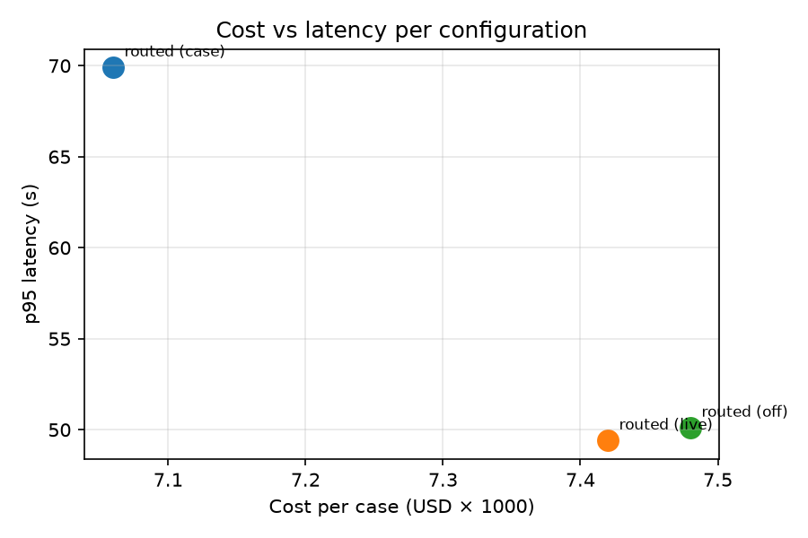
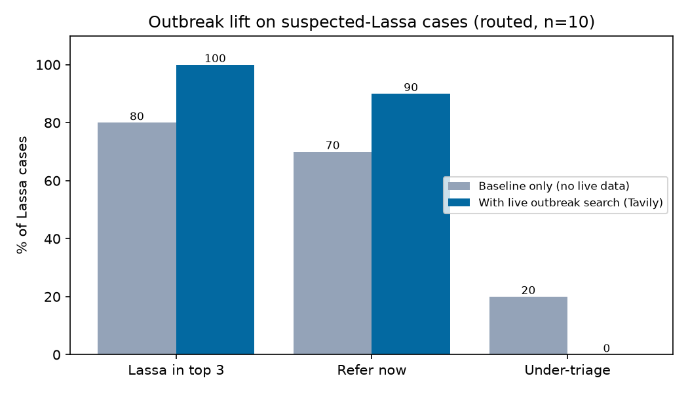

# Ibà eval report

> Synthetic vignettes; gold labels **not yet clinician-reviewed**. Treat these numbers as
> a development check, not a clinical validation.

## Metrics

| Config (outbreak) | n | Danger-sign recall | **Under-triage** | Over-triage | Exact triage | Top-3 dx hit | Citation validity | p50 / p95 latency | Cost / case |
|---|---|---|---|---|---|---|---|---|---|
| routed (case) | 10 | 100.0% (4 signs) | **0.0%** | 0.0% | 100.0% | 100.0% | 100.0% (44) | 30.2 s / 69.9 s | $0.00706 |
| routed (live) | 10 | 100.0% (1 signs) | **0.0%** | 10.0% | 90.0% | 100.0% | 100.0% (36) | 35.1 s / 49.4 s | $0.00742 |
| routed (off) | 10 | 100.0% (1 signs) | **20.0%** | 10.0% | 70.0% | 80.0% | 100.0% (53) | 33.8 s / 50.1 s | $0.00748 |

- **Under-triage** (predicted less urgent than gold) is the headline safety metric.
- Citation validity = model citations that resolved to an indexed guideline chunk or a current outbreak source (deterministic check).
- Latency uses each step's original model time (cache replays report the first run's time).

### Under-triaged cases: routed (case)

None.

### Under-triaged cases: routed (live)

None.

### Under-triaged cases: routed (off)

- **la-05** (suspected_lassa): gold Refer now, got Treat & monitor. Missed danger signs: none. Differential: Bacterial tonsillitis/pharyngitis, Viral upper respiratory infection, Typhoid fever. Model rationale: "No danger signs present, fever duration less than 7 days, malaria test negative and no response to antimalarial suggests another cause manageable at primary health centre with reassessment and symptomatic care."
- **la-09** (suspected_lassa): gold Refer now, got Treat & monitor. Missed danger signs: none. Differential: Bacterial infection (e.g., typhoid), Viral illness (e.g., influenza), Persistent malaria (low parasitemia or resistance). Model rationale: "No danger signs identified, fever duration less than 7 days, malaria test negative and no response to antimalarial; manage at primary health centre with reassessment, repeat testing, and advice to return if worsening."

## Outbreak lift (suspected-Lassa cases)

Same cases run with live outbreak search off (static baseline only) and with it on.
The 'with' arm is the **real Tavily search** over trusted public-health domains, cached per state per day. A live Lassa signal for the patient's own state was found for 8 of the 10 cases (la-01, la-02, la-03, la-04, la-07, la-08, la-09, la-10); the rest fall back to static endemicity, which is why the lift is smaller than the mock run suggested.

| Config | n | | Lassa in top 3 | Refer now | Under-triage |
|---|---|---|---|---|---|
| routed | 10 | without live signal | 80.0% | 70.0% | 20.0% |
| routed | 10 | with live signal | 100.0% | 90.0% | 0.0% |

## Grounding

### Retrieval: was the defining guideline passage retrieved?

| Strategy | k | Cases | Key-passage hit | Guideline-doc hit | Misses |
|---|---|---|---|---|---|
| single symptom query (before) | 6 | 10 | 90.0% | 100.0% | mn-01 |
| per-condition queries + doc prior (after) | 6 | 10 | 100.0% | 100.0% | — |
| single symptom query (before) | 8 | 10 | 90.0% | 100.0% | mn-01 |
| per-condition queries + doc prior (after) | 8 | 10 | 100.0% | 100.0% | — |

### Claims

| Run | Cases | Model claims | Quote-verified | Marked unsupported | Judged pairs | Judge: supported | partial | unsupported |
|---|---|---|---|---|---|---|---|---|
| 1. Citations only (no quote requirement) | 10 | 95 | — | — | 95 (10 cases) | 40.0% | 25.3% | 34.7% |
| 2. Quote-backed claims | 10 | 72 | 70.8% | 29.2% | 66 (10 cases) | 84.8% | 3.0% | 12.1% |
| 3. + trimmed passages, parallel embedding | 10 | 84 | 69.0% | 31.0% | 0 (0 cases) | — | — | — |

- **Quote-verified**: the claim's evidence quote (8–40 words) was found in the cited chunk (deterministic; normalised whitespace, dashes and quotes; fuzzy ratio ≥ 0.9). Everything else is **marked unsupported** and shown as "AI suggestion — no guideline source".
- **Judge** columns are LLM-judged (Nemotron 3 Super, reasoning off): does the cited chunk support the claim? A screening signal, not ground truth.
- Before: each claim bundled a condition with all its reasons and patient facts. After: one claim per reason or action; patient facts are excluded (they need no guideline source).

Quote-verified claims only (n=51): judge says supported 94.1%, partial 2.0%, unsupported 3.9%.

## Charts

