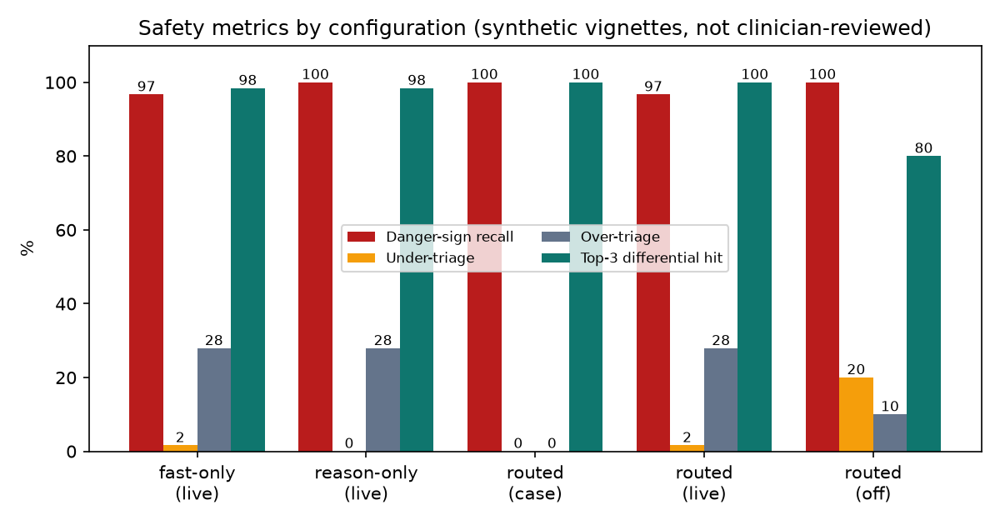
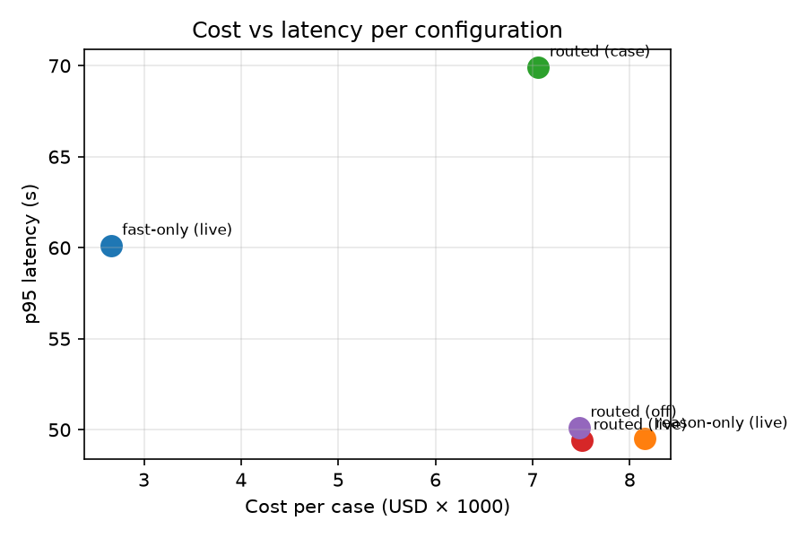
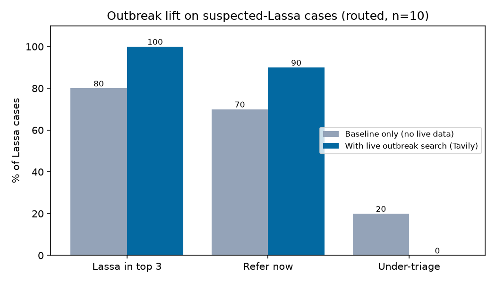

# Ibà eval report

> Synthetic vignettes; gold labels **not yet clinician-reviewed**. Treat these numbers as
> a development check, not a clinical validation.

## Metrics

| Config (outbreak) | n | Danger-sign recall | **Under-triage** | Over-triage | Exact triage | Top-3 dx hit | Citation validity | p50 / p95 latency | Cost / case |
|---|---|---|---|---|---|---|---|---|---|
| fast-only (live) | 60 | 96.7% (30 signs) | **1.7%** | 28.3% | 70.0% | 98.3% | 100.0% (211) | 36.9 s / 57.4 s | $0.00263 |
| reason-only (live) | 60 | 100.0% (30 signs) | **0.0%** | 28.3% | 71.7% | 98.3% | 100.0% (304) | 35.1 s / 48.7 s | $0.00814 |
| routed (case) | 10 | 100.0% (4 signs) | **0.0%** | 0.0% | 100.0% | 100.0% | 100.0% (44) | 30.2 s / 69.9 s | $0.00706 |
| routed (live) | 60 | 96.7% (30 signs) | **1.7%** | 28.3% | 70.0% | 100.0% | 100.0% (279) | 34.5 s / 49.5 s | $0.00746 |
| routed (off) | 10 | 100.0% (1 signs) | **20.0%** | 10.0% | 70.0% | 80.0% | 100.0% (53) | 33.8 s / 50.1 s | $0.00748 |

- **Under-triage** (predicted less urgent than gold) is the headline safety metric.
- Citation validity = model citations that resolved to an indexed guideline chunk or a current outbreak source (deterministic check).
- Latency uses each step's original model time (cache replays report the first run's time).

### Under-triaged cases: fast-only (live)

- **pd-03** (paediatric_danger_signs): gold Refer now, got Refer within 24h. Missed danger signs: lethargy_or_unconsciousness. Differential: Lassa fever, Malaria (uncomplicated), Bacterial fever (e.g., typhoid). Model rationale: "Active Lassa fever outbreak in Enugu state; patient febrile for 2 days with no danger signs; requires isolation and urgent evaluation at a higher facility."

### Under-triaged cases: reason-only (live)

None.

### Under-triaged cases: routed (case)

None.

### Under-triaged cases: routed (live)

- **pd-03** (paediatric_danger_signs): gold Refer now, got Refer within 24h. Missed danger signs: lethargy_or_unconsciousness. Differential: Malaria, Lassa fever, Possible bacterial infection. Model rationale: "No danger signs are present, but the child is 1 year old with 2 days of fever and nonspecific symptoms (quiet, not playing, sleepy). Given the active Lassa fever outbreak in Enugu, close monitoring and timely referral to"

### Under-triaged cases: routed (off)

- **la-05** (suspected_lassa): gold Refer now, got Treat & monitor. Missed danger signs: none. Differential: Bacterial tonsillitis/pharyngitis, Viral upper respiratory infection, Typhoid fever. Model rationale: "No danger signs present, fever duration less than 7 days, malaria test negative and no response to antimalarial suggests another cause manageable at primary health centre with reassessment and symptomatic care."
- **la-09** (suspected_lassa): gold Refer now, got Treat & monitor. Missed danger signs: none. Differential: Bacterial infection (e.g., typhoid), Viral illness (e.g., influenza), Persistent malaria (low parasitemia or resistance). Model rationale: "No danger signs identified, fever duration less than 7 days, malaria test negative and no response to antimalarial; manage at primary health centre with reassessment, repeat testing, and advice to return if worsening."

## Outbreak lift (suspected-Lassa cases)

Same cases run with live outbreak search off (static baseline only) and with it on.
The 'with' arm is the **real Tavily search** over trusted public-health domains, cached per state per day. A live Lassa signal for the patient's own state was found for 9 of the 10 cases (la-01, la-02, la-03, la-04, la-05, la-07, la-08, la-09, la-10); the rest fall back to static endemicity, which is why the lift is smaller than the mock run suggested.

| Config | n | | Lassa in top 3 | Refer now | Under-triage |
|---|---|---|---|---|---|
| routed | 10 | without live signal | 80.0% | 70.0% | 20.0% |
| routed | 10 | with live signal | 100.0% | 90.0% | 0.0% |

## Citation support (LLM-judged)

**This section is judged by an LLM** (Nemotron 3 Super, reasoning off) on a ~20% sample of cases: does the cited guideline chunk support the claim it is attached to? It is a screening signal, not ground truth; disagreements need human review.

| Config (outbreak) | Cases | Pairs | Supported | Partial | Unsupported |
|---|---|---|---|---|---|
| fast-only (live) | 12 | 51 | 76.5% | 7.8% | 15.7% |
| reason-only (live) | 12 | 61 | 91.8% | 3.3% | 4.9% |
| routed (live) | 12 | 62 | 85.5% | 4.8% | 9.7% |
- unsupported: `who-malaria:0233` for "Uncomplicated malaria: A patient who presents with symptoms of malaria and a positive parasitological test (microscopy o": The passage discusses additional considerations for managing malaria cases, including oral tolerance, antipyretics, anti-emetics, and seizures, but does not define uncomplicated malaria based on symptoms, positive parasitological test, and absence of severe features.
- unsupported: `ncdc-cholera:0030` for "Cholera: Cholera is suspected in a patient with acute watery diarrhoea and severe dehydration in an endemic area.": The passage discusses cholera assessment and dehydration classification but does not mention that cholera is suspected in a patient with acute watery diarrhoea and severe dehydration in an endemic area.
- unsupported: `who-imci:0004` for "Place the patient in a separate holding area and institute infection prevention measures.": The passage discusses dehydration classifications and treatments but contains no mention of placing patients in separate holding areas or instituting infection prevention measures.
- partial: `who-malaria:0303` for "Initiate intravenous fluids and monitor vital signs, urine output, and blood glucose every 4 hours": The passage mentions monitoring vital signs, urine output, and blood glucose every 4 hours as part of supportive care for severe malaria, which aligns with the claim, but does not mention initiating intravenous fluids.
- unsupported: `who-imci:0002` for "Refer the child urgently to hospital with infection prevention measures for suspected Lassa Fever": The passage describes urgent referral for general danger signs but does not mention Lassa Fever or infection prevention measures.
- unsupported: `who-imci:0027` for "Advise patient to return if fever persists beyond 3 days": The passage advises returning in 3 days only if malaria test is positive, not generally for persistent fever beyond 3 days.
- unsupported: `who-malaria:0302` for "Refer patient urgently to higher-level facility": The passage discusses pre-referral treatment recommendations for severe malaria but does not explicitly recommend urgent referral to a higher-level facility.
- unsupported: `who-imci:0027` for "Perform malaria rapid diagnostic test.": The passage mentions repeating a malaria test under specific conditions but does not support performing a malaria rapid diagnostic test as an initial or standalone action.
- unsupported: `who-imci:0027` for "Advise patient to return if fever persists beyond 3 days": The passage advises returning in 3 days only if malaria test is positive, not generally for persistent fever beyond 3 days.

## Grounding

### Retrieval: was the defining guideline passage retrieved?

| Strategy | k | Cases | Key-passage hit | Guideline-doc hit | Misses |
|---|---|---|---|---|---|
| single symptom query (before) | 6 | 10 | 90.0% | 100.0% | mn-01 |
| per-condition queries + doc prior (after) | 6 | 10 | 100.0% | 100.0% | — |
| single symptom query (before) | 8 | 10 | 90.0% | 100.0% | mn-01 |
| per-condition queries + doc prior (after) | 8 | 10 | 100.0% | 100.0% | — |

### Claims

| Run | Cases | Model claims | Quote-verified | Marked unsupported | Judged pairs | Judge: supported | partial | unsupported |
|---|---|---|---|---|---|---|---|---|
| 1. Citations only (no quote requirement) | 10 | 95 | — | — | 95 (10 cases) | 40.0% | 25.3% | 34.7% |
| 2. Quote-backed claims | 10 | 72 | 70.8% | 29.2% | 66 (10 cases) | 84.8% | 3.0% | 12.1% |
| 3. + trimmed passages, parallel embedding | 10 | 84 | 69.0% | 31.0% | 0 (0 cases) | — | — | — |

- **Quote-verified**: the claim's evidence quote (8–40 words) was found in the cited chunk (deterministic; normalised whitespace, dashes and quotes; fuzzy ratio ≥ 0.9). Everything else is **marked unsupported** and shown as "AI suggestion — no guideline source".
- **Judge** columns are LLM-judged (Nemotron 3 Super, reasoning off): does the cited chunk support the claim? A screening signal, not ground truth.
- Before: each claim bundled a condition with all its reasons and patient facts. After: one claim per reason or action; patient facts are excluded (they need no guideline source).

Quote-verified claims only (n=51): judge says supported 94.1%, partial 2.0%, unsupported 3.9%.

## Charts

